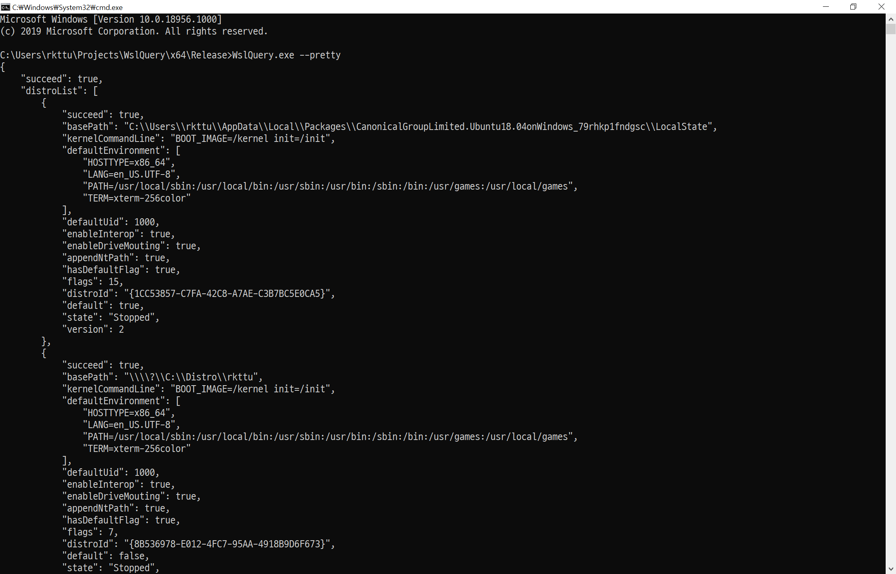

# WslQuery



[최신 버전 다운로드](https://github.com/rkttu/WslQuery/releases/latest/download/WslQuery.exe)ㅁ
이 프로그램은 WSL(Windows Subsystem for Linux)의 내부 정보를 시스템에서 읽어온 후 해당 정보들을 표준 출력 장치에서 사용할 수 있는 JSON 형식으로 출력해줍니다.

## 활용 방법

이 프로그램의 활용법은 간단합니다.

`WslQuery.exe [--pretty]`

* `--pretty`: 이 옵션은 JSON 데이터를 사람이 읽을 수 있는 형태로 출력합니다.

## 빌드 환경

- .NET 5
- Native AOT Compiler

## Credits

```
Gears Icon
icons8.com (https://icons8.com/icons/set/gears)
```
