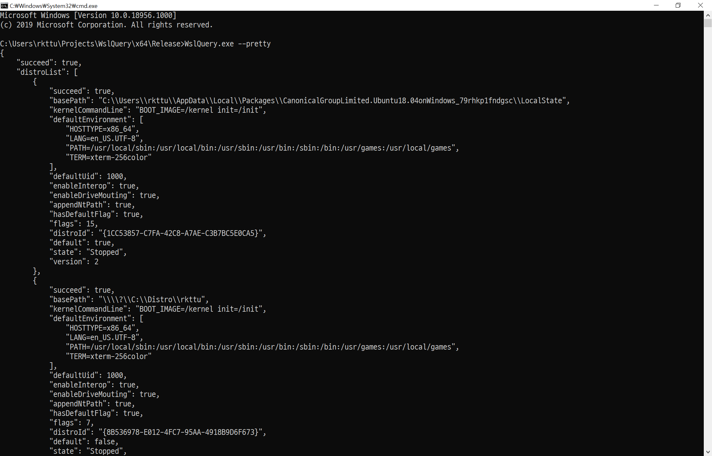

# WslQuery

[한국어](README.ko-kr.md)



WslQuery reads the current Windows user's registered WSL distributions and writes their configuration to standard output as JSON. This source targets .NET 10 and publishes a standalone Windows x64 Native AOT executable.

[Published releases](https://github.com/wslhub/WslQuery/releases) may predate these source changes. The screenshot shows an earlier release.

## Usage and exit codes

Run the executable from a Windows terminal:

```console
WslQuery.exe [--pretty] [--help]
```

- `--pretty`: indent JSON output. Option matching is case-insensitive.
- `--help` or `-h`: display usage without accessing WSL.
- Exit `0`: all queried distributions succeeded, an empty list, or help.
- Exit `1`: unsupported platform, WSL/query failure, or at least one failed distribution.
- Exit `2`: unknown argument.

Successful queries emit a JSON array. An installed WSL API with no distribution registrations produces `[]`. Diagnostics go to stderr. Partial query failures preserve the JSON results and report failure through the exit code and each item's `hResult` and `succeed` fields.

## JSON compatibility

The output keeps all 16 property names from Wslhub.Sdk 0.1.2, including `hResult`, `succeed`, `isDefault` and `isDefaultDistro`. Flags remain JSON numbers. System.Text.Json source generation removes reflection-based serialization and the Newtonsoft.Json dependency.

The modernization corrects default-distribution flags and prevents an unregistered distribution from reporting success. `defaultUid` uses the Windows API's unsigned 32-bit range. Missing optional `basePath` values appear as `null`. JSON escaping may differ from older releases; consumers can parse the values instead of comparing raw text. See the [original SDK contract](https://github.com/wslhub/wsl-sdk-dotnet/blob/78e6c9d/src/Wslhub.Sdk/DistroInfo.cs) and [WSL configuration API](https://learn.microsoft.com/en-us/windows/win32/api/wslapi/nf-wslapi-wslgetdistributionconfiguration).

## Build and Native AOT publishing

Build prerequisites:

- A supported Windows x64 installation with WSL for live queries
- The latest serviced .NET 10 SDK; `global.json` accepts stable .NET 10 feature bands
- Visual Studio Build Tools with Desktop development with C++ and a Windows SDK for Native AOT

Publish from the repository root on Windows:

```powershell
dotnet publish src/WslQuery/WslQuery.csproj -c Release -r win-x64 -p:PublishAot=true -o artifacts/win-x64
```

`src\publish.cmd` runs the same publish command and propagates its exit code. The published `WslQuery.exe` runs without a separate .NET installation. Distribute the included license notices alongside it. Cross-OS Native AOT compilation is not supported; see the [Native AOT prerequisites](https://learn.microsoft.com/en-us/dotnet/core/deploying/native-aot/).

## Regression and Windows validation

Run the dependency-free regression executable from the repository root:

```console
dotnet build src/WslQuery.sln -c Release -warnaserror
dotnet run --project src/WslQuery.Tests -c Release --no-build
```

The tests cover the JSON contract, argument and error handling, UTF-8 native buffers and Windows registry enumeration. Registry fixtures use a unique key under `HKCU\Software\WslQuery.Tests`, remove it afterwards and never modify WSL registrations. Windows-only cases are skipped on other operating systems.

GitHub Actions builds on Linux and Windows, publishes Windows x64 Native AOT, and runs `tests/SmokeTest.ps1` against the executable. A runner without usable WSL only verifies the controlled failure path. Successful configuration queries against populated WSL 1 and WSL 2 distributions remain a separate integration check. See the [test workflow](.github/workflows/ci.yml).

## Dependency and native-call security

The application has no explicit runtime NuGet package dependencies. It uses the .NET 10 shared libraries and official SDK Native AOT tooling. The old experimental feed and ILCompiler alpha package are removed. NuGet auditing runs during CI restores; CodeQL and Dependabot configuration live under `.github`.

Native calls use source-generated bindings and restrict DLL lookup to Windows System32. Registry access is read-only and uses the current user's 64-bit view. Environment strings and their native array are released with `CoTaskMemFree`, as required by the [WSL API contract](https://learn.microsoft.com/en-us/windows/win32/api/wslapi/nf-wslapi-wslgetdistributionconfiguration). WslQuery does not launch a distribution command or send query output to a network service.

Removing Newtonsoft.Json addresses the dependency behind [CVE-2024-21907](https://github.com/advisories/GHSA-5crp-9r3c-p9vr). The old application only serialized its WSL model; this review did not establish a remotely exploitable JSON-input path. Native AOT executables bundle runtime code, so rebuilding and redistributing with current [.NET 10 servicing updates](https://dotnet.microsoft.com/en-us/platform/support/policy/dotnet-core) also matters.

## Credits and license

The Korean README incorporates [Xeppetto's contribution in PR #5](https://github.com/wslhub/WslQuery/pull/5). Its original author commit is retained.

WSL query models and bindings derive from [Wslhub.Sdk](https://github.com/wslhub/wsl-sdk-dotnet). Its MIT notice is included in [THIRD-PARTY-NOTICES.txt](THIRD-PARTY-NOTICES.txt). WslQuery is covered by [LICENSE](LICENSE). The gears icon comes from [Icons8](https://icons8.com/icons/set/gears).
